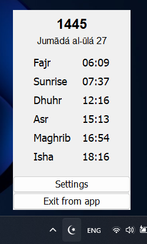

# Salah Times App

**Important Warnings**:
  - **Prayer Times Depend on Settings**: Customize the app to get the correct times.
  - **Compare with Nearby Mosques**: Always compare the prayer times shown by the app with the times of nearby mosques.

Salah Times is a Java Swing application that provides prayer times based on the user's location. It features a text widget with a transparent background, making it customizable and convenient for users.

## Features

- **Widget with Transparent Background**: The app includes a text widget that can be placed anywhere on the screen.

- **Draggable**: The widget is draggable, allowing users to place it wherever they prefer, such as on the taskbar.

- **Customization Options**:
  - **Location**: Users can change the location to get accurate prayer times for their specific area.
  - **Calculation Method**: The app supports various calculation methods for prayer times.
  - **School**: Users can choose school for prayer time calculations.

- **Multilingual Support**: Currently available in English, Uzbek, and Russian. Additional languages can be easily added by creating new message.properties files.

## Screenshots


*Widget*


*Settings window*


*Popup menu*

## Installation

### Prerequisites
- Java (if using the jar file)

### Download
- Jar and exe files can be downloaded from the [releases page](https://github.com/Khoshimjonov/SalahTimes/releases).

### Clone and Run
1. Clone the repository to your local machine:

    ```bash
    git clone https://github.com/Khoshimjonov/SalahTimes.git
    ```

2. Open the project in your preferred Java IDE.

3. Build and run the application.

### Launch
- When the app is opened the settings window will appear.
- Enter valid location data to ensure accurate prayer times.

### Usage

1. After configuring the app, the widget will display the next prayer time and the remaining time.
2. Drag the widget to your preferred location on the screen.
3. Find the app icon in the tray to close the application.

## License

This project is licensed under the MIT License - see the [LICENSE](LICENSE) file for details.

## Contributing

Everyone is welcome to contribute to the project.

## Acknowledgments

- Thanks to [api.aladhan.com](https://api.aladhan.com) for providing accurate prayer time data.
- Thanks to [nominatim.openstreetmap.org](https://nominatim.openstreetmap.org) for geocoding services.
- Thanks to [api.open-elevation.com](https://api.open-elevation.com) for elevation data.

## Support

For any issues or questions, please [open an issue](https://github.com/Khoshimjonov/SalahTimes/issues).
